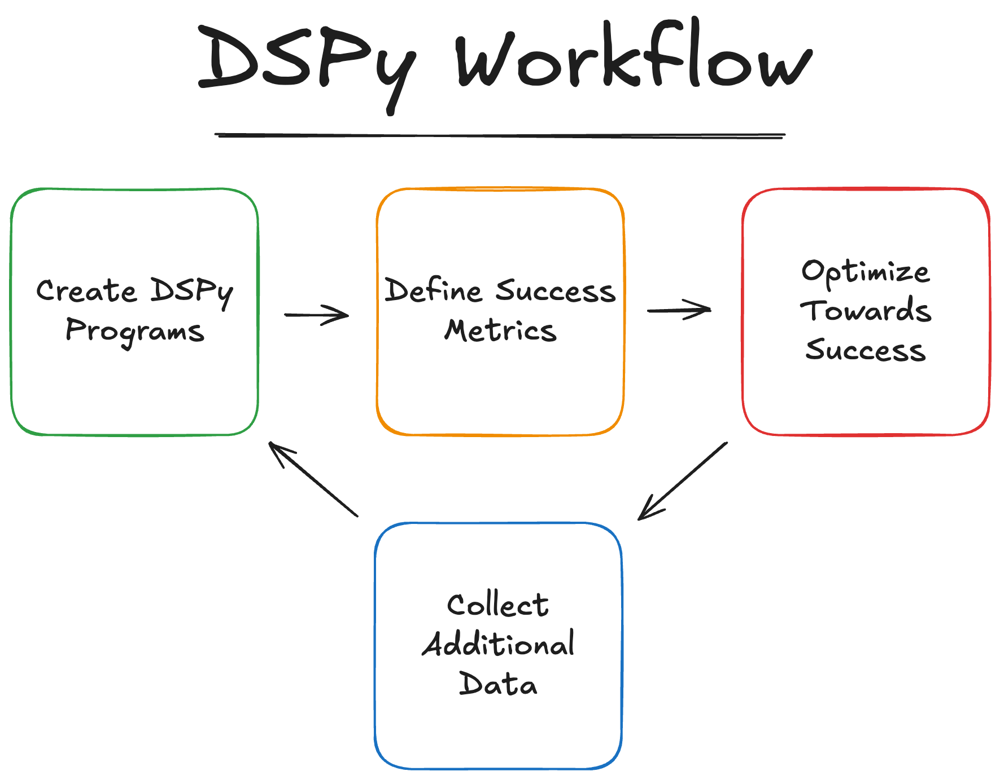

# Programming (Not Prompting) Your LLM with DSPy

DSPy (Declarative Self-improving Python) is a framework from Stanford NLP that treats language models as programmable functions rather than prompt templates. It provides a PyTorch-like interface for defining, composing, and optimizing LLM operations. Instead of writing and maintaining complex prompts, developers specify input/output signatures and let DSPy handle prompt engineering and optimization. The framework enables systematic improvement of LLM pipelines through techniques like automatic prompt tuning and self-improvement.

The DSPy workflow follows 4 main steps:
1. Define your program using signatures and modules
2. Create measurable success metrics that clearly show your program's performance
3. Compile your program and optimize towards success metrics
4. Collect additional data and iterate

We'll look through and apply all the various approaches DSPy offers across these steps in this notebook!
